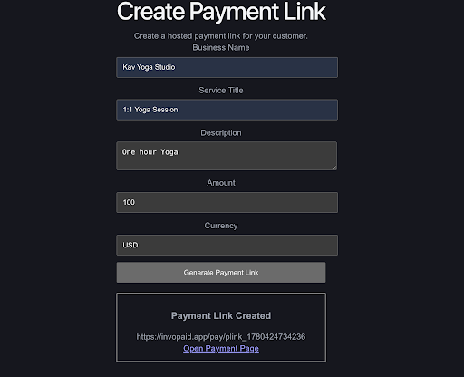
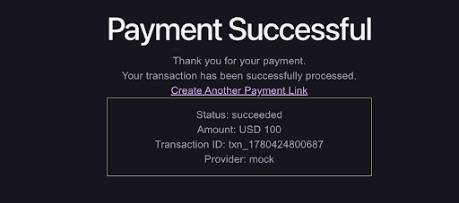

# Invopaid

Invopaid is a payment-link platform that allows businesses to create hosted payment links, share them with customers, and track payment transactions.

This MVP demonstrates a complete payment flow from payment-link creation through checkout and payment confirmation using a mock payment provider.

## Live Demo

Frontend:
https://invopaid.vercel.app

Backend:
https://invopaid.onrender.com

GitHub Repository:
https://github.com/nairk1729/invopaid

## Features

* Create payment links
* Hosted checkout experience
* Transaction tracking
* Payment status updates through webhooks
* SQLite persistence
* Provider adapter architecture
* React frontend and Node.js backend
* Foundation for AI-assisted payment operations workflows

## Tech Stack

### Frontend

* React
* React Router
* Vite

### Backend

* Node.js
* Express

### Database

* SQLite
* better-sqlite3

## Architecture

Frontend → Backend API → Service Layer → Provider Adapter → SQLite Database

The backend uses a layered architecture:

* Routes
* Controllers
* Services
* Provider Adapters
* Database Layer

This separation makes it easier to integrate additional payment providers in the future.

## API Endpoints

### Create Payment Link

POST /payment-links

Creates a new payment link.

### Get Payment Link

GET /payment-links/:id

Returns payment-link details.

### Create Checkout Session

POST /checkout-session

Creates a transaction and checkout session.

### Get Transaction

GET /transactions/:id

Returns transaction details.

### Payment Webhook

POST /webhooks/payment

Updates transaction status.

## Screenshots

### Create Payment Link



### Checkout


### Payment Confirmation



## Local Development

### Backend

```bash
cd backend
npm install
npm run dev
```

### Frontend

```bash
cd frontend
npm install
npm run dev
```

## Environment Variables

Create a `.env` file in the backend directory:

```env
PORT=4000
APP_NAME=invopaid-backend
PAYMENT_PROVIDER=mock
CHECKOUT_BASE_URL=https://checkout.invopaid.app
PAYMENT_BASE_URL=https://invopaid.app/pay
```

## Status

Invopaid MVP v1 completed.


## Future Roadmap

### Payments Platform

* Stripe integration
* User authentication
* Merchant dashboard
* Email notifications
* Transaction reporting

### AI-Assisted Operations

* Natural-language transaction search
* Merchant operations copilot
* Payment reconciliation assistance
* Compliance workflow automation
* Risk and anomaly monitoring
* Cash-flow insights and forecasting

### Merchant Copilot (AI Operations Assistant)

* Answers operational questions about payment activity
* Provides pending payment visibility
* Uses transaction data stored in SQLite
* Built using React, Express, and a service-based architecture
* Designed to support future LLM integration
